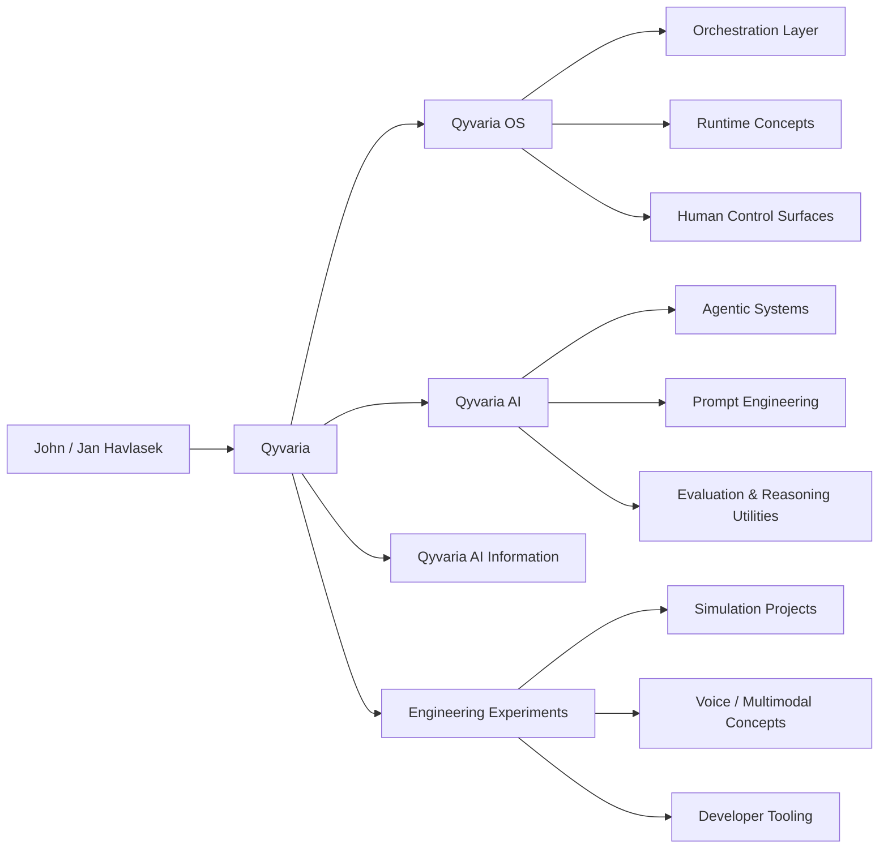

<!--
Profile README for: Havlasek1John
Repository name must be exactly: Havlasek1John
Place this file at: Havlasek1John/README.md

This profile README is intentionally ambitious and highly visual while staying within GitHub-renderable Markdown + HTML patterns.
Licensing notes below are a public-facing summary, not a replacement for repository-specific LICENSE files or legal advice.
-->

<p align="center">
  
</p>

<p align="center">
  
</p>

<h1 align="center">Hi, I'm John / Jan Havlasek 👋</h1>

<p align="center">
  <strong>AI Engineer · Cybernetics & Intelligent Control · Human–Machine Systems · Qyvaria Founder</strong>
</p>

<p align="center">
  I build ambitious AI-oriented software systems, simulation concepts, orchestration frameworks, human-centered intelligent tools, and the evolving <strong>Qyvaria ecosystem</strong>.
</p>

<p align="center">
  <a href="https://qyvaria-ai-studio-index.vercel.app/">
    
  </a>
  <a href="https://github.com/Havlasek1John">
    
  </a>
  
</p>

<p align="center">
  
  
  
  
</p>

<p align="center">
  
  
  
</p>

---

# Navigation

<p align="center">
  <a href="#mission-control">Mission Control</a> ·
  <a href="#about-john--jan-havlasek">About</a> ·
  <a href="#qyvaria-ecosystem">Qyvaria Ecosystem</a> ·
  <a href="#qyvaria-os">Qyvaria OS</a> ·
  <a href="#featured-projects">Featured Projects</a> ·
  <a href="#engineering-stack">Engineering Stack</a> ·
  <a href="#github-analytics">GitHub Analytics</a> ·
  <a href="#licensing-philosophy">Licensing</a> ·
  <a href="#collaboration">Collaboration</a>
</p>

---

# Mission Control

<table>
  <tr>
    <td width="33%" valign="top">
      <h3>Identity</h3>
      <p><strong>John / Jan Havlasek</strong></p>
      <p>AI engineer, systems thinker, cybernetics-focused builder, and founder of the Qyvaria ecosystem.</p>
    </td>
    <td width="33%" valign="top">
      <h3>Mission</h3>
      <p>Design intelligent systems that combine <strong>AI capability</strong>, <strong>human control</strong>, <strong>simulation</strong>, and <strong>long-term architecture</strong>.</p>
    </td>
    <td width="33%" valign="top">
      <h3>Build Model</h3>
      <p><strong>Commercial-friendly public releases</strong> where expressly permitted, with <strong>protected core IP</strong> and strategic ownership preserved.</p>
    </td>
  </tr>
</table>

```text
┌─────────────────────────────────────────────────────────────────────┐
│ SYSTEM PROFILE                                                      │
├─────────────────────────────────────────────────────────────────────┤
│ Founder        : John / Jan Havlasek                                │
│ Ecosystem      : Qyvaria · Qyvaria AI · Qyvaria OS                  │
│ Core Focus     : AI systems · cybernetics · intelligent control     │
│ Build Style    : modular · orchestration-first · future-facing      │
│ Human Principle: people remain in command of intelligent systems    │
│ Access Model   : free commercial use where explicit + protected core│
└─────────────────────────────────────────────────────────────────────┘
```

---

# About John / Jan Havlasek

I am **John / Jan Havlasek**, an AI-focused engineer and creator working at the intersection of:

* **Artificial intelligence**
* **Cybernetics**
* **Intelligent control**
* **Simulation-oriented engineering**
* **Human–machine systems**
* **Automation and orchestration**
* **Long-horizon software ecosystems**

I am building a public technical identity around the **Qyvaria ecosystem**, a family of projects and ideas centered on advanced AI systems, modular orchestration, simulation concepts, technical experimentation, and long-term software architecture.

My approach is not only about producing isolated scripts. I am interested in designing **systems that can evolve**:

* Systems with structure, not random accumulation
* AI workflows with logic, not only prompts
* Modules that can coordinate, not only exist independently
* Human-centered software that increases capability without removing agency
* Public technical work that communicates a larger vision

I believe the next generation of useful AI software will depend not only on stronger models, but also on better **coordination layers**, **memory structures**, **decision flows**, **safety boundaries**, **evaluation ideas**, and **interfaces between people and machines**.

That belief is reflected in the growing Qyvaria direction.

---

# Builder Philosophy

<table>
  <tr>
    <td width="50%" valign="top">
      <h3>Systems Over Fragments</h3>
      <p>A feature can be impressive. A coherent system can become a platform. I design toward ecosystems, architectures, and reusable technical foundations.</p>
    </td>
    <td width="50%" valign="top">
      <h3>AI With Direction</h3>
      <p>I am interested in AI that is structured, guided, inspectable, and connected to real workflows rather than added as decoration.</p>
    </td>
  </tr>
  <tr>
    <td width="50%" valign="top">
      <h3>Cybernetic Thinking</h3>
      <p>Feedback loops, adaptation, control, and human–machine interaction shape how I think about intelligent software and orchestration.</p>
    </td>
    <td width="50%" valign="top">
      <h3>Human-Centered Intelligence</h3>
      <p>Intelligent systems should increase human clarity, capability, and creative power while preserving meaningful control.</p>
    </td>
  </tr>
</table>

---

# Qyvaria Ecosystem

<p align="center">
  
  
  
</p>

**Qyvaria** is the umbrella identity for a growing collection of AI-oriented, engineering-driven, and future-facing software ideas. It is built around the principle that intelligent technology should be:

* **Useful**
* **Expandable**
* **Human-directed**
* **Technically serious**
* **Creative but disciplined**
* **Accessible where possible**
* **Protected where necessary**

Qyvaria is intended to unify multiple technical directions under one coherent vision:

| Direction                 | Purpose                                                                                                                        |
| ------------------------- | ------------------------------------------------------------------------------------------------------------------------------ |
| **Qyvaria AI**            | AI-focused systems, prompt-oriented utilities, agentic experiments, and intelligent tooling                                    |
| **Qyvaria OS**            | A system-level orchestration concept for modular AI workflows, runtime thinking, and human-controlled intelligent environments |
| **Qyvaria Documentation** | Public information, project descriptions, direction-setting, and open material                                                 |
| **Simulation Concepts**   | Structured experiments that explore intelligent behavior, coordination, and engineering models                                 |
| **Tooling & Utilities**   | Practical software pieces that support generation, testing, analysis, organization, and automation                             |

---

## Ecosystem Architecture



---

# Qyvaria OS

**Qyvaria OS** is one of the most ambitious pillars of the ecosystem. The name “OS” is used to express a **system-level approach**: a coordinated environment for intelligent modules, AI workflows, orchestration ideas, engineering experiments, and human-directed control.

Qyvaria OS is not merely a label. It represents a philosophy:

> **Intelligent software should be organized as an environment, not scattered as disconnected utilities.**

## What Qyvaria OS Represents

* A modular orchestration mindset
* A future-facing AI environment
* A conceptual control plane for advanced workflows
* A place for runtime, agent, memory, and interface ideas to meet
* A public direction for system-level engineering experiments
* A human-centered approach to complex intelligent tools

## Qyvaria OS Design Themes

<table>
  <tr>
    <td width="33%" valign="top">
      <h3>Modularity</h3>
      <p>Capabilities should be extendable without destroying the structure of the larger system.</p>
    </td>
    <td width="33%" valign="top">
      <h3>Orchestration</h3>
      <p>Intelligent components become more useful when they can coordinate across tasks, tools, and stages.</p>
    </td>
    <td width="33%" valign="top">
      <h3>Control</h3>
      <p>The human remains the owner of purpose, permissions, direction, and final judgment.</p>
    </td>
  </tr>
  <tr>
    <td width="33%" valign="top">
      <h3>Simulation</h3>
      <p>Complex ideas can be tested, modeled, and refined before becoming durable systems.</p>
    </td>
    <td width="33%" valign="top">
      <h3>Runtime Thinking</h3>
      <p>Qyvaria OS explores how modules, policies, agents, and tools can operate as a coordinated environment.</p>
    </td>
    <td width="33%" valign="top">
      <h3>Long-Term Growth</h3>
      <p>The ecosystem is designed to expand through repositories, documents, prototypes, and architectural evolution.</p>
    </td>
  </tr>
</table>

---

# Qyvaria AI

**Qyvaria AI** is the applied intelligence layer of the ecosystem. It focuses on how AI can be used in practical, structured, and ambitious ways.

## Areas of Interest

* Prompt engineering and generation systems
* AI-assisted creativity and technical drafting
* Agentic workflow concepts
* Model-facing utilities
* Intelligent analysis pipelines
* Human review loops
* Memory, safety, and accountability ideas
* Voice and multimodal experimentation
* Simulation-driven behavior design

## Why It Matters

I am interested in moving beyond “AI as a feature” toward **AI as infrastructure**: something that can connect tools, modules, data, interfaces, and user intention into larger intelligent workflows.

---

# Current Technical Direction

The Qyvaria body of work explores many connected ideas, including:

| Area                            | Direction                                                   |
| ------------------------------- | ----------------------------------------------------------- |
| **Agentic systems**             | Multi-step intelligent behavior with human oversight        |
| **Simulation modules**          | Controlled environments for exploring system behavior       |
| **Kernel / mesh thinking**      | Coordinated runtime ideas for larger ecosystems             |
| **Memory systems**              | Context, retrieval, continuity, and structured state        |
| **Voice / multimodal concepts** | Conversational runtimes and richer interfaces               |
| **Reasoning utilities**         | Evaluation, planning, analysis, and structured outputs      |
| **Developer tooling**           | Code, workflow, analysis, and automation helpers            |
| **Safety & accountability**     | Human-in-loop, explainable, logged, and reversible behavior |

---

# Featured Projects

## Core Public Repositories

<p align="center">
  <a href="https://github.com/Havlasek1John/Qyvaria-OS-">
    
  </a>
  <a href="https://github.com/Havlasek1John/Qyvaria-AI">
    
  </a>
</p>

<p align="center">
  <a href="https://github.com/Havlasek1John/Qyvaria-AI-Information">
    
  </a>
</p>

## Repository Overview

| Project                                                                               | Role in the Ecosystem                                                                                   |
| ------------------------------------------------------------------------------------- | ------------------------------------------------------------------------------------------------------- |
| **[Qyvaria-OS-](https://github.com/Havlasek1John/Qyvaria-OS-)**                       | System-level project space for orchestration, intelligent environments, and OS-style technical ambition |
| **[Qyvaria-AI](https://github.com/Havlasek1John/Qyvaria-AI)**                         | AI-focused repository for intelligent utilities, experiments, and applied Qyvaria ideas                 |
| **[Qyvaria-AI-Information](https://github.com/Havlasek1John/Qyvaria-AI-Information)** | Public information, documentation, direction, and ecosystem context                                     |

---

# Engineering Stack

<p align="center">
  
</p>

## Working Technologies

<p align="center">
  
  
  
  
</p>

<p align="center">
  
  
  
  
</p>

## Engineering Practices

* Modular scripting and utilities
* Repository identity and public positioning
* Long-form technical documentation
* AI workflow design
* Human-centered system thinking
* Experimental architecture with a path to structure
* Commercially useful releases where terms explicitly allow it
* Protected strategic foundations where ownership must remain clear

---

# Focus Matrix

<table>
  <tr>
    <td width="25%" valign="top"><strong>AI Engineering</strong><br/>Prompt systems, evaluation, agents, orchestration, intelligent utilities.</td>
    <td width="25%" valign="top"><strong>Cybernetics</strong><br/>Feedback, control, adaptation, system behavior, human-machine loops.</td>
    <td width="25%" valign="top"><strong>Simulation</strong><br/>Modeling, experiments, behavioral testing, runtime exploration.</td>
    <td width="25%" valign="top"><strong>Automation</strong><br/>Repeatable workflows, tooling, system coordination, useful leverage.</td>
  </tr>
  <tr>
    <td width="25%" valign="top"><strong>Human–Machine Systems</strong><br/>Interfaces that preserve control while increasing capability.</td>
    <td width="25%" valign="top"><strong>Agentic Concepts</strong><br/>Task decomposition, collaboration among modules, guided autonomy.</td>
    <td width="25%" valign="top"><strong>Documentation</strong><br/>Clear public context, technical direction, project narratives.</td>
    <td width="25%" valign="top"><strong>Hybrid Licensing</strong><br/>Accessible public releases plus protected core ownership.</td>
  </tr>
</table>

---

# GitHub Analytics

<p align="center">
  
  
</p>

<p align="center">
  
</p>

<p align="center">
  
</p>

---

# Licensing Philosophy

<p align="center">
  
  
  
</p>

A central principle of my public software work is a **hybrid access model**:

> **I want publicly released Qyvaria software to be useful, broadly accessible, and commercially friendly where that permission is expressly granted, while preserving ownership of protected core code, proprietary architecture, unreleased modules, strategic implementations, and the long-term integrity of the Qyvaria ecosystem.**

## Commercial-Friendly Access

My intention is to allow **free commercial use** for released software **when the specific repository license and documentation explicitly grant that right**. This helps:

* Independent builders
* Researchers
* Startups
* Businesses
* Creators
* Technical collaborators

use public tools in meaningful real-world contexts without unnecessary barriers.

## Protected Core Ownership

At the same time, I retain control over:

* Protected core code
* Proprietary architecture
* Strategic modules
* Internal implementations
* Unreleased systems
* Brand identity connected to John / Jan Havlasek, Qyvaria, and Qyvaria OS

This preserves the ability to build long-term, maintain a coherent direction, and protect original technical work.

## Practical Summary

| Layer                       | Access Position                                                  |
| --------------------------- | ---------------------------------------------------------------- |
| Publicly released utilities | May be commercially usable where the repository terms say so     |
| Open documentation          | Intended to communicate ideas, direction, and context            |
| Core intellectual property  | Retained and protected by the creator or relevant Qyvaria entity |
| Repository-specific license | Always controls the exact legal permission                       |

## Important Note

This profile README explains my overall philosophy. It does **not** replace:

* A repository’s `LICENSE` file
* Written commercial permission terms
* Source-file notices
* Contributor terms
* Formal legal advice

Where no explicit permission is stated, no additional rights should be assumed beyond what the repository clearly grants.

---

# Public Commercial Permission Statement

For repositories where this model applies, a concise public statement may read:

> **Commercial Use Policy:** This project may be used free of charge in commercial and non-commercial contexts only where expressly permitted by the repository’s license and documentation. Publicly released components are shared to encourage experimentation, productivity, and innovation. However, the creator retains ownership of protected core code, proprietary architecture, unreleased modules, project branding, and strategic internal implementations associated with John / Jan Havlasek, Qyvaria, and Qyvaria OS. The repository-specific LICENSE file governs the exact legal terms.

---

# Collaboration

I am open to serious technical discussion and thoughtful collaboration around:

* AI engineering
* Cybernetics
* Intelligent control
* Agentic systems
* Simulation concepts
* Human–machine systems
* Automation and orchestration
* Documentation-heavy technical projects
* Experimental software ecosystems

I value collaboration that respects:

* Clear ownership
* Repository licensing
* Attribution
* Thoughtful technical communication
* Protected strategic foundations
* Serious long-term direction

---

# Deep Dive Panels

<details>
  <summary><strong>🧭 Qyvaria OS Doctrine</strong></summary>
  <br/>
  <p><strong>Qyvaria OS</strong> is a system-level vision for intelligent software environments. It represents coordination, orchestration, modular runtime thinking, and human-controlled complexity.</p>
  <p>The long-term doctrine can be summarized as:</p>
  <ul>
    <li>Build reusable architectures, not disposable fragments.</li>
    <li>Use AI as an organized capability layer, not only as a chatbot.</li>
    <li>Preserve human direction, permissions, and judgment.</li>
    <li>Document the system as it grows so future collaborators can understand it.</li>
    <li>Balance openness with strategic protection of original work.</li>
  </ul>
</details>

<details>
  <summary><strong>🧠 Research & Engineering Interests</strong></summary>
  <br/>
  <ul>
    <li>Agentic workflow orchestration</li>
    <li>AI simulation environments</li>
    <li>Memory and retrieval concepts</li>
    <li>Evaluation and self-checking utilities</li>
    <li>Voice-first and multimodal systems</li>
    <li>Human-centered intelligent interfaces</li>
    <li>Systems architecture for emerging AI products</li>
  </ul>
</details>

<details>
  <summary><strong>⚖️ Hybrid Licensing Summary</strong></summary>
  <br/>
  <p>The philosophy is simple: <strong>share useful public software generously where explicit terms allow it, including commercial use where granted, while protecting core inventions, strategic architecture, unreleased implementations, and the long-term identity of Qyvaria.</strong></p>
  <p>This lets public projects remain practical and adoption-friendly without unintentionally transferring ownership of the deeper platform vision.</p>
</details>

<details>
  <summary><strong>📌 What This GitHub Profile Is Becoming</strong></summary>
  <br/>
  <p>This profile is intended to become a public command center for:</p>
  <ul>
    <li>Qyvaria and Qyvaria OS</li>
    <li>AI engineering experiments</li>
    <li>Documentation and system narratives</li>
    <li>Simulation-oriented concepts</li>
    <li>Tooling, utilities, and orchestration ideas</li>
    <li>Collaborative technical discussion</li>
  </ul>
</details>

---

# Connect

<p align="center">
  <a href="https://qyvaria-ai-studio-index.vercel.app/">
    
  </a>
  <a href="https://github.com/Havlasek1John">
    
  </a>
</p>

---

# Closing Statement

I am building **Qyvaria**, **Qyvaria AI**, and **Qyvaria OS** as ambitious, long-term technical directions centered on intelligent systems, orchestration, human-centered software, cybernetic thinking, and future-facing engineering.

My work is guided by a simple belief:

> **The future of AI will be shaped not only by stronger models, but by better systems around them — better orchestration, better interfaces, better control, better documentation, better safety boundaries, and better alignment between human purpose and machine capability.**

<p align="center">
  <em>Engineering intelligent systems with clarity, ambition, and long-term vision.</em>
</p>

<p align="center">
  
</p>
