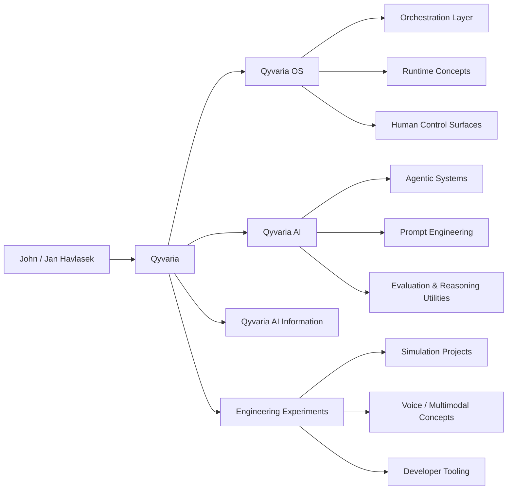
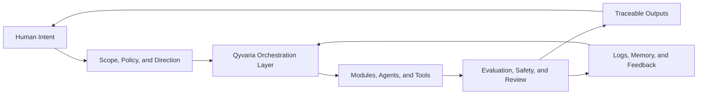
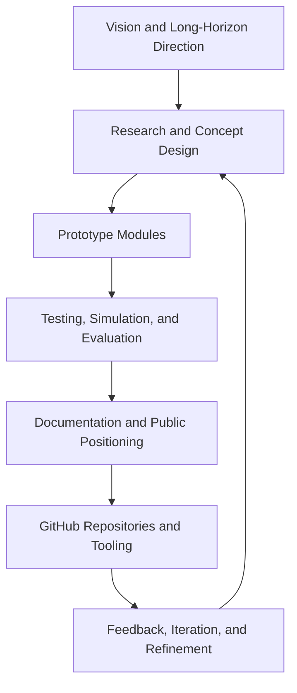
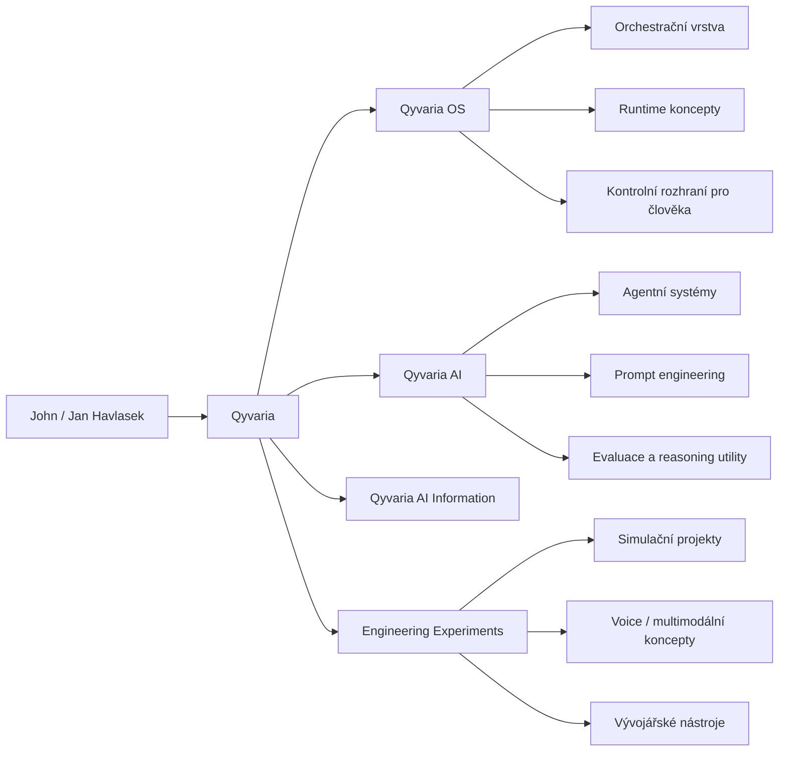
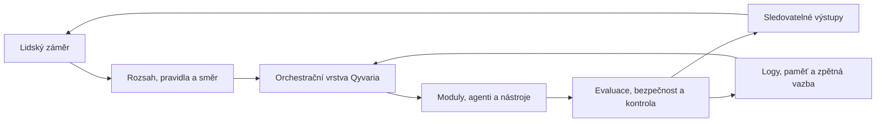
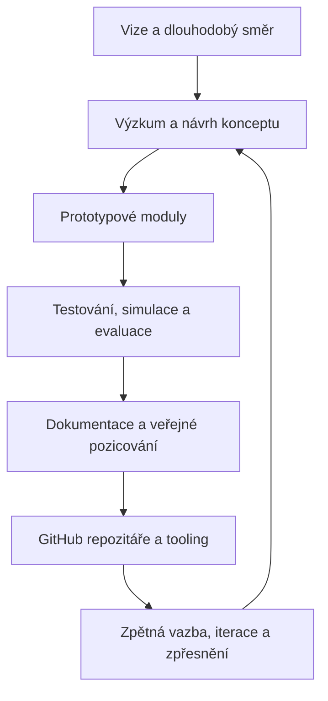

<!--
Bilingual GitHub profile README for: Havlasek1John
Use this file as README.md if you want English and Czech in one file with internal anchor links.
-->

<p align="center">
  <strong>Language / Jazyk:</strong>
  <a href="#english-version"><strong>English</strong></a> ·
  <a href="#ceska-verze"><strong>Čeština</strong></a>
</p>

<p align="center">
  <em>Click a language above to jump between English and Czech sections inside this README.</em>
</p>

---

<a id="english-version"></a>

# English Version

<p align="center">
  
</p>

<h1 align="center">John / Jan Havlasek</h1>

<h3 align="center">Qyvaria Founder · AI Engineer · Cybernetics & Intelligent Control</h3>

<p align="center">
  <strong>Building modular AI ecosystems for orchestration, simulation, runtime thinking, human-centered control, and long-horizon engineering.</strong>
</p>

<p align="center">
  
</p>

<p align="center">
  <a href="https://qyvaria-ai-studio-index.vercel.app/">
    
  </a>
  <a href="https://github.com/Havlasek1John">
    
  </a>
  
</p>

<p align="center">
  
  
  
  
</p>

<p align="center">
  
  
  
</p>

---

# Navigation

<p align="center">
  <a href="#mission-control">Mission Control</a> ·
  <a href="#about-john--jan-havlasek">About</a> ·
  <a href="#qyvaria-ecosystem">Qyvaria Ecosystem</a> ·
  <a href="#qyvaria-os">Qyvaria OS</a> ·
  <a href="#qyvaria-control--engineering-graphs">System Graphs</a> ·
  <a href="#featured-projects">Featured Projects</a> ·
  <a href="#engineering-stack">Engineering Stack</a> ·
  <a href="#github-analytics">GitHub Analytics</a> ·
  <a href="#licensing-philosophy">Licensing</a> ·
  <a href="#collaboration">Collaboration</a>
</p>

---

# Mission Control

<table>
  <tr>
    <td width="33%" valign="top">
      <h3>Identity</h3>
      <p><strong>John / Jan Havlasek</strong></p>
      <p>AI engineer, systems thinker, cybernetics-focused builder, and founder of the Qyvaria ecosystem.</p>
    </td>
    <td width="33%" valign="top">
      <h3>Mission</h3>
      <p>Design intelligent systems that combine <strong>AI capability</strong>, <strong>human control</strong>, <strong>simulation</strong>, and <strong>long-term architecture</strong>.</p>
    </td>
    <td width="33%" valign="top">
      <h3>Build Model</h3>
      <p><strong>Commercial-friendly public releases</strong> where expressly permitted, with <strong>protected core IP</strong> and strategic ownership preserved.</p>
    </td>
  </tr>
</table>

```text
┌─────────────────────────────────────────────────────────────────────┐
│ SYSTEM PROFILE                                                      │
├─────────────────────────────────────────────────────────────────────┤
│ Founder        : John / Jan Havlasek                                │
│ Ecosystem      : Qyvaria · Qyvaria AI · Qyvaria OS                  │
│ Core Focus     : AI systems · cybernetics · intelligent control     │
│ Build Style    : modular · orchestration-first · future-facing      │
│ Human Principle: people remain in command of intelligent systems    │
│ Access Model   : free commercial use where explicit + protected core│
└─────────────────────────────────────────────────────────────────────┘
```

---

# About John / Jan Havlasek

I am **John / Jan Havlasek**, an AI-focused engineer and creator working at the intersection of:

* **Artificial intelligence**
* **Cybernetics**
* **Intelligent control**
* **Simulation-oriented engineering**
* **Human–machine systems**
* **Automation and orchestration**
* **Long-horizon software ecosystems**

I am building a public technical identity around the **Qyvaria ecosystem**, a family of projects and ideas centered on advanced AI systems, modular orchestration, simulation concepts, technical experimentation, and long-term software architecture.

My approach is not only about producing isolated scripts. I am interested in designing **systems that can evolve**:

* Systems with structure, not random accumulation
* AI workflows with logic, not only prompts
* Modules that can coordinate, not only exist independently
* Human-centered software that increases capability without removing agency
* Public technical work that communicates a larger vision

I believe the next generation of useful AI software will depend not only on stronger models, but also on better **coordination layers**, **memory structures**, **decision flows**, **safety boundaries**, **evaluation ideas**, and **interfaces between people and machines**.

That belief is reflected in the growing Qyvaria direction.

---

# Builder Philosophy

<table>
  <tr>
    <td width="50%" valign="top">
      <h3>Systems Over Fragments</h3>
      <p>A feature can be impressive. A coherent system can become a platform. I design toward ecosystems, architectures, and reusable technical foundations.</p>
    </td>
    <td width="50%" valign="top">
      <h3>AI With Direction</h3>
      <p>I am interested in AI that is structured, guided, inspectable, and connected to real workflows rather than added as decoration.</p>
    </td>
  </tr>
  <tr>
    <td width="50%" valign="top">
      <h3>Cybernetic Thinking</h3>
      <p>Feedback loops, adaptation, control, and human–machine interaction shape how I think about intelligent software and orchestration.</p>
    </td>
    <td width="50%" valign="top">
      <h3>Human-Centered Intelligence</h3>
      <p>Intelligent systems should increase human clarity, capability, and creative power while preserving meaningful control.</p>
    </td>
  </tr>
</table>

---

# Qyvaria Ecosystem

<p align="center">
  
  
  
</p>

**Qyvaria** is the umbrella identity for a growing collection of AI-oriented, engineering-driven, and future-facing software ideas. It is built around the principle that intelligent technology should be:

* **Useful**
* **Expandable**
* **Human-directed**
* **Technically serious**
* **Creative but disciplined**
* **Accessible where possible**
* **Protected where necessary**

Qyvaria is intended to unify multiple technical directions under one coherent vision:

| Direction                 | Purpose                                                                                                                        |
| ------------------------- | ------------------------------------------------------------------------------------------------------------------------------ |
| **Qyvaria AI**            | AI-focused systems, prompt-oriented utilities, agentic experiments, and intelligent tooling                                    |
| **Qyvaria OS**            | A system-level orchestration concept for modular AI workflows, runtime thinking, and human-controlled intelligent environments |
| **Qyvaria Documentation** | Public information, project descriptions, direction-setting, and open material                                                 |
| **Simulation Concepts**   | Structured experiments that explore intelligent behavior, coordination, and engineering models                                 |
| **Tooling & Utilities**   | Practical software pieces that support generation, testing, analysis, organization, and automation                             |

---

## Ecosystem Architecture



---

# Qyvaria OS

**Qyvaria OS** is one of the most ambitious pillars of the ecosystem. The name “OS” is used to express a **system-level approach**: a coordinated environment for intelligent modules, AI workflows, orchestration ideas, engineering experiments, and human-directed control.

Qyvaria OS is not merely a label. It represents a philosophy:

> **Intelligent software should be organized as an environment, not scattered as disconnected utilities.**

## What Qyvaria OS Represents

* A modular orchestration mindset
* A future-facing AI environment
* A conceptual control plane for advanced workflows
* A place for runtime, agent, memory, and interface ideas to meet
* A public direction for system-level engineering experiments
* A human-centered approach to complex intelligent tools

## Qyvaria OS Design Themes

<table>
  <tr>
    <td width="33%" valign="top">
      <h3>Modularity</h3>
      <p>Capabilities should be extendable without destroying the structure of the larger system.</p>
    </td>
    <td width="33%" valign="top">
      <h3>Orchestration</h3>
      <p>Intelligent components become more useful when they can coordinate across tasks, tools, and stages.</p>
    </td>
    <td width="33%" valign="top">
      <h3>Control</h3>
      <p>The human remains the owner of purpose, permissions, direction, and final judgment.</p>
    </td>
  </tr>
  <tr>
    <td width="33%" valign="top">
      <h3>Simulation</h3>
      <p>Complex ideas can be tested, modeled, and refined before becoming durable systems.</p>
    </td>
    <td width="33%" valign="top">
      <h3>Runtime Thinking</h3>
      <p>Qyvaria OS explores how modules, policies, agents, and tools can operate as a coordinated environment.</p>
    </td>
    <td width="33%" valign="top">
      <h3>Long-Term Growth</h3>
      <p>The ecosystem is designed to expand through repositories, documents, prototypes, and architectural evolution.</p>
    </td>
  </tr>
</table>

---

# Qyvaria AI

**Qyvaria AI** is the applied intelligence layer of the ecosystem. It focuses on how AI can be used in practical, structured, and ambitious ways.

## Areas of Interest

* Prompt engineering and generation systems
* AI-assisted creativity and technical drafting
* Agentic workflow concepts
* Model-facing utilities
* Intelligent analysis pipelines
* Human review loops
* Memory, safety, and accountability ideas
* Voice and multimodal experimentation
* Simulation-driven behavior design

## Why It Matters

I am interested in moving beyond “AI as a feature” toward **AI as infrastructure**: something that can connect tools, modules, data, interfaces, and user intention into larger intelligent workflows.

---

# Current Technical Direction

The Qyvaria body of work explores many connected ideas, including:

| Area                            | Direction                                                   |
| ------------------------------- | ----------------------------------------------------------- |
| **Agentic systems**             | Multi-step intelligent behavior with human oversight        |
| **Simulation modules**          | Controlled environments for exploring system behavior       |
| **Kernel / mesh thinking**      | Coordinated runtime ideas for larger ecosystems             |
| **Memory systems**              | Context, retrieval, continuity, and structured state        |
| **Voice / multimodal concepts** | Conversational runtimes and richer interfaces               |
| **Reasoning utilities**         | Evaluation, planning, analysis, and structured outputs      |
| **Developer tooling**           | Code, workflow, analysis, and automation helpers            |
| **Safety & accountability**     | Human-in-loop, explainable, logged, and reversible behavior |

---


# Qyvaria Control & Engineering Graphs

## Human-Controlled Orchestration Loop



## Ecosystem Build Pipeline



## Qyvaria System Layers

| Layer | Responsibility | Public Profile Signal |
| --- | --- | --- |
| **Human Direction** | Purpose, permissions, final judgment | Human-centered intelligence |
| **Orchestration** | Coordinating modules, tasks, workflows | Qyvaria OS vision |
| **Intelligence Utilities** | Prompt systems, reasoning helpers, analysis flows | Qyvaria AI |
| **Simulation & Testing** | Controlled experimentation, evaluation ideas | Engineering discipline |
| **Documentation** | Public context, technical narratives, clarity | Long-term ecosystem building |
| **Protected Core** | Strategic foundations and unreleased architecture | Ownership and continuity |

---

# Featured Projects

## Core Public Repositories

<table>
  <tr>
    <td width="33%" valign="top">
      <h3 align="center"><a href="https://github.com/Havlasek1John/Qyvaria-OS-">Qyvaria OS</a></h3>
      <p align="center"><strong>AI browser · orchestration environment · public release hub</strong></p>
      <p>System-level repository for Qyvaria OS release materials, installer documentation, public licensing files, security notes, and long-term orchestration direction.</p>
      <p align="center"><a href="https://github.com/Havlasek1John/Qyvaria-OS-"><strong>Open Repository →</strong></a></p>
    </td>
    <td width="33%" valign="top">
      <h3 align="center"><a href="https://github.com/Havlasek1John/Qyvaria-AI">Qyvaria AI</a></h3>
      <p align="center"><strong>Applied intelligence · experiments · AI tooling direction</strong></p>
      <p>Public project space for Qyvaria AI concepts, intelligent software experimentation, emerging utilities, and the applied intelligence side of the ecosystem.</p>
      <p align="center"><a href="https://github.com/Havlasek1John/Qyvaria-AI"><strong>Open Repository →</strong></a></p>
    </td>
    <td width="33%" valign="top">
      <h3 align="center"><a href="https://github.com/Havlasek1John/Qyvaria-AI-Information">Qyvaria AI Information</a></h3>
      <p align="center"><strong>Open data · public context · ecosystem information</strong></p>
      <p>Documentation-centered repository for public Qyvaria information, open-source data, ecosystem framing, and reference material supporting the wider vision.</p>
      <p align="center"><a href="https://github.com/Havlasek1John/Qyvaria-AI-Information"><strong>Open Repository →</strong></a></p>
    </td>
  </tr>
</table>

## Repository Overview

| Project                                                                               | Role in the Ecosystem                                                                                   |
| ------------------------------------------------------------------------------------- | ------------------------------------------------------------------------------------------------------- |
| **[Qyvaria-OS-](https://github.com/Havlasek1John/Qyvaria-OS-)**                       | System-level project space for orchestration, intelligent environments, and OS-style technical ambition |
| **[Qyvaria-AI](https://github.com/Havlasek1John/Qyvaria-AI)**                         | AI-focused repository for intelligent utilities, experiments, and applied Qyvaria ideas                 |
| **[Qyvaria-AI-Information](https://github.com/Havlasek1John/Qyvaria-AI-Information)** | Public information, documentation, direction, and ecosystem context                                     |

---

# Engineering Stack

<p align="center">
  
</p>

## Working Technologies

<p align="center">
  
  
  
  
</p>

<p align="center">
  
  
  
  
</p>

## Engineering Practices

* Modular scripting and utilities
* Repository identity and public positioning
* Long-form technical documentation
* AI workflow design
* Human-centered system thinking
* Experimental architecture with a path to structure
* Commercially useful releases where terms explicitly allow it
* Protected strategic foundations where ownership must remain clear

---

# Focus Matrix

<table>
  <tr>
    <td width="25%" valign="top"><strong>AI Engineering</strong><br/>Prompt systems, evaluation, agents, orchestration, intelligent utilities.</td>
    <td width="25%" valign="top"><strong>Cybernetics</strong><br/>Feedback, control, adaptation, system behavior, human-machine loops.</td>
    <td width="25%" valign="top"><strong>Simulation</strong><br/>Modeling, experiments, behavioral testing, runtime exploration.</td>
    <td width="25%" valign="top"><strong>Automation</strong><br/>Repeatable workflows, tooling, system coordination, useful leverage.</td>
  </tr>
  <tr>
    <td width="25%" valign="top"><strong>Human–Machine Systems</strong><br/>Interfaces that preserve control while increasing capability.</td>
    <td width="25%" valign="top"><strong>Agentic Concepts</strong><br/>Task decomposition, collaboration among modules, guided autonomy.</td>
    <td width="25%" valign="top"><strong>Documentation</strong><br/>Clear public context, technical direction, project narratives.</td>
    <td width="25%" valign="top"><strong>Hybrid Licensing</strong><br/>Accessible public releases plus protected core ownership.</td>
  </tr>
</table>

---

# GitHub Analytics

<p align="center">
  
</p>

<p align="center">
  
</p>

<p align="center">
  
  
</p>

<p align="center">
  
  
</p>

<p align="center">
  
</p>

<p align="center">
  
</p>

## Analytics Readout

| Visual | What it communicates |
| --- | --- |
| **Trophy Dashboard** | Visible milestones, public GitHub achievements, and progress signals |
| **Profile Details Graph** | Contribution rhythm and account-level development activity |
| **Stats + Top Languages** | Repository activity, public engineering footprint, and language distribution |
| **Repository vs Commit Language Cards** | Difference between repository breadth and commit concentration |
| **Streak Card** | Consistency and sustained activity patterns |
| **Activity Graph** | Recent contribution momentum over time |

---

# Licensing Philosophy

<p align="center">
  
  
  
</p>

A central principle of my public software work is a **hybrid access model**:

> **I want publicly released Qyvaria software to be useful, broadly accessible, and commercially friendly where that permission is expressly granted, while preserving ownership of protected core code, proprietary architecture, unreleased modules, strategic implementations, and the long-term integrity of the Qyvaria ecosystem.**

## Commercial-Friendly Access

My intention is to allow **free commercial use** for released software **when the specific repository license and documentation explicitly grant that right**. This helps:

* Independent builders
* Researchers
* Startups
* Businesses
* Creators
* Technical collaborators

use public tools in meaningful real-world contexts without unnecessary barriers.

## Protected Core Ownership

At the same time, I retain control over:

* Protected core code
* Proprietary architecture
* Strategic modules
* Internal implementations
* Unreleased systems
* Brand identity connected to John / Jan Havlasek, Qyvaria, and Qyvaria OS

This preserves the ability to build long-term, maintain a coherent direction, and protect original technical work.

## Practical Summary

| Layer                       | Access Position                                                  |
| --------------------------- | ---------------------------------------------------------------- |
| Publicly released utilities | May be commercially usable where the repository terms say so     |
| Open documentation          | Intended to communicate ideas, direction, and context            |
| Core intellectual property  | Retained and protected by the creator or relevant Qyvaria entity |
| Repository-specific license | Always controls the exact legal permission                       |

## Important Note

This profile README explains my overall philosophy. It does **not** replace:

* A repository’s `LICENSE` file
* Written commercial permission terms
* Source-file notices
* Contributor terms
* Formal legal advice

Where no explicit permission is stated, no additional rights should be assumed beyond what the repository clearly grants.

---

# Public Commercial Permission Statement

For repositories where this model applies, a concise public statement may read:

> **Commercial Use Policy:** This project may be used free of charge in commercial and non-commercial contexts only where expressly permitted by the repository’s license and documentation. Publicly released components are shared to encourage experimentation, productivity, and innovation. However, the creator retains ownership of protected core code, proprietary architecture, unreleased modules, project branding, and strategic internal implementations associated with John / Jan Havlasek, Qyvaria, and Qyvaria OS. The repository-specific LICENSE file governs the exact legal terms.

---

# Collaboration

I am open to serious technical discussion and thoughtful collaboration around:

* AI engineering
* Cybernetics
* Intelligent control
* Agentic systems
* Simulation concepts
* Human–machine systems
* Automation and orchestration
* Documentation-heavy technical projects
* Experimental software ecosystems

I value collaboration that respects:

* Clear ownership
* Repository licensing
* Attribution
* Thoughtful technical communication
* Protected strategic foundations
* Serious long-term direction

---

# Deep Dive Panels

<details>
  <summary><strong>🧭 Qyvaria OS Doctrine</strong></summary>
  <br/>
  <p><strong>Qyvaria OS</strong> is a system-level vision for intelligent software environments. It represents coordination, orchestration, modular runtime thinking, and human-controlled complexity.</p>
  <p>The long-term doctrine can be summarized as:</p>
  <ul>
    <li>Build reusable architectures, not disposable fragments.</li>
    <li>Use AI as an organized capability layer, not only as a chatbot.</li>
    <li>Preserve human direction, permissions, and judgment.</li>
    <li>Document the system as it grows so future collaborators can understand it.</li>
    <li>Balance openness with strategic protection of original work.</li>
  </ul>
</details>

<details>
  <summary><strong>🧠 Research & Engineering Interests</strong></summary>
  <br/>
  <ul>
    <li>Agentic workflow orchestration</li>
    <li>AI simulation environments</li>
    <li>Memory and retrieval concepts</li>
    <li>Evaluation and self-checking utilities</li>
    <li>Voice-first and multimodal systems</li>
    <li>Human-centered intelligent interfaces</li>
    <li>Systems architecture for emerging AI products</li>
  </ul>
</details>

<details>
  <summary><strong>⚖️ Hybrid Licensing Summary</strong></summary>
  <br/>
  <p>The philosophy is simple: <strong>share useful public software generously where explicit terms allow it, including commercial use where granted, while protecting core inventions, strategic architecture, unreleased implementations, and the long-term identity of Qyvaria.</strong></p>
  <p>This lets public projects remain practical and adoption-friendly without unintentionally transferring ownership of the deeper platform vision.</p>
</details>

<details>
  <summary><strong>📌 What This GitHub Profile Is Becoming</strong></summary>
  <br/>
  <p>This profile is intended to become a public command center for:</p>
  <ul>
    <li>Qyvaria and Qyvaria OS</li>
    <li>AI engineering experiments</li>
    <li>Documentation and system narratives</li>
    <li>Simulation-oriented concepts</li>
    <li>Tooling, utilities, and orchestration ideas</li>
    <li>Collaborative technical discussion</li>
  </ul>
</details>

---

# Connect

<p align="center">
  <a href="https://qyvaria-ai-studio-index.vercel.app/">
    
  </a>
  <a href="https://github.com/Havlasek1John">
    
  </a>
</p>

---

# Closing Statement

I am building **Qyvaria**, **Qyvaria AI**, and **Qyvaria OS** as ambitious, long-term technical directions centered on intelligent systems, orchestration, human-centered software, cybernetic thinking, and future-facing engineering.

My work is guided by a simple belief:

> **The future of AI will be shaped not only by stronger models, but by better systems around them — better orchestration, better interfaces, better control, better documentation, better safety boundaries, and better alignment between human purpose and machine capability.**

<p align="center">
  <em>Engineering intelligent systems with clarity, ambition, and long-term vision.</em>
</p>

<p align="center">
  
</p>


---

<a id="ceska-verze"></a>

# Česká verze

<p align="center">
  <strong>Language / Jazyk:</strong>
  <a href="README.md"><strong>English</strong></a> ·
  <a href="README.cs.md"><strong>Čeština</strong></a>
</p>

<p align="center">
  <em>Kliknutím na jazyk výše přepneš mezi anglickou a českou verzí GitHub profilu.</em>
</p>

---

<p align="center">
  
</p>

<h1 align="center">John / Jan Havlasek</h1>

<h3 align="center">Zakladatel Qyvaria · AI engineer · Kybernetika & inteligentní řízení</h3>

<p align="center">
  <strong>Budování modulárních AI ekosystémů pro orchestraci, simulace, runtime thinking, člověkem řízenou kontrolu a dlouhodobé inženýrství.</strong>
</p>

<p align="center">
  
</p>

<p align="center">
  <a href="https://qyvaria-ai-studio-index.vercel.app/">
    
  </a>
  <a href="https://github.com/Havlasek1John">
    
  </a>
  
</p>

<p align="center">
  
  
  
  
</p>

<p align="center">
  
  
  
</p>

---

<a id="navigace"></a>
# Navigace

<p align="center">
  <a href="#ridici-panel-mise">Řídicí panel mise</a> ·
  <a href="#o-johnovi--janovi-havlaskovi">O mně</a> ·
  <a href="#ekosystem-qyvaria">Ekosystém Qyvaria</a> ·
  <a href="#qyvaria-os">Qyvaria OS</a> ·
  <a href="#grafy-rizeni-a-inzenyrstvi-qyvaria">Systémové grafy</a> ·
  <a href="#vybrane-projekty">Vybrané projekty</a> ·
  <a href="#inzenyrsky-stack">Inženýrský stack</a> ·
  <a href="#github-analytika">GitHub analytika</a> ·
  <a href="#licencni-filozofie">Licencování</a> ·
  <a href="#spoluprace">Spolupráce</a>
</p>

---

<a id="ridici-panel-mise"></a>
# Řídicí panel mise

<table>
  <tr>
    <td width="33%" valign="top">
      <h3>Identita</h3>
      <p><strong>John / Jan Havlasek</strong></p>
      <p>AI engineer, systémový myslitel, tvůrce zaměřený na kybernetiku a zakladatel ekosystému Qyvaria.</p>
    </td>
    <td width="33%" valign="top">
      <h3>Mise</h3>
      <p>Navrhovat inteligentní systémy, které spojují <strong>schopnosti AI</strong>, <strong>lidskou kontrolu</strong>, <strong>simulaci</strong> a <strong>dlouhodobou architekturu</strong>.</p>
    </td>
    <td width="33%" valign="top">
      <h3>Model tvorby</h3>
      <p><strong>Veřejné releasy přátelské ke komerčnímu použití</strong> tam, kde je to výslovně povoleno, se zachováním <strong>chráněného jádra IP</strong> a strategického vlastnictví.</p>
    </td>
  </tr>
</table>

```text
┌─────────────────────────────────────────────────────────────────────┐
│ SYSTEM PROFILE                                                      │
├─────────────────────────────────────────────────────────────────────┤
│ Founder        : John / Jan Havlasek                                │
│ Ecosystem      : Qyvaria · Qyvaria AI · Qyvaria OS                  │
│ Core Focus     : AI systems · cybernetics · intelligent control     │
│ Build Style    : modular · orchestration-first · future-facing      │
│ Human Principle: people remain in command of intelligent systems    │
│ Access Model   : explicit commercial use + protected core           │
└─────────────────────────────────────────────────────────────────────┘
```

---

<a id="o-johnovi--janovi-havlaskovi"></a>
# O Johnovi / Janovi Havlaskovi

Jsem **John / Jan Havlasek**, AI zaměřený engineer a tvůrce pracující na průsečíku:

* **Umělé inteligence**
* **Kybernetiky**
* **Inteligentního řízení**
* **Simulačně orientovaného inženýrství**
* **Systémů člověk–stroj**
* **Automatizace a orchestrace**
* **Dlouhodobých softwarových ekosystémů**

Buduję veřejnou technickou identitu kolem **ekosystému Qyvaria** — rodiny projektů a myšlenek zaměřených na pokročilé AI systémy, modulární orchestraci, simulační koncepty, technické experimentování a dlouhodobou softwarovou architekturu.

Můj přístup není jen o vytváření izolovaných skriptů. Zajímá mě navrhování **systémů, které se mohou vyvíjet**:

* Systémy se strukturou, ne náhodné hromadění funkcí
* AI workflow s logikou, ne pouze prompty
* Moduly, které spolupracují, ne jen samostatně existují
* Software zaměřený na člověka, který zvyšuje schopnosti bez odebrání kontroly
* Veřejná technická práce, která komunikuje širší vizi

Věřím, že další generace užitečného AI softwaru nebude záviset jen na silnějších modelech, ale také na lepších **koordinačních vrstvách**, **paměťových strukturách**, **rozhodovacích tocích**, **bezpečnostních hranicích**, **evaluačních nápadech** a **rozhraních mezi lidmi a stroji**.

Tato víra se promítá do rostoucího směru Qyvaria.

---

<a id="filozofie-tvorby"></a>
# Filozofie tvorby

<table>
  <tr>
    <td width="50%" valign="top">
      <h3>Systémy místo fragmentů</h3>
      <p>Jedna funkce může být působivá. Koherentní systém se může stát platformou. Navrhuji směrem k ekosystémům, architekturám a opakovaně použitelným technickým základům.</p>
    </td>
    <td width="50%" valign="top">
      <h3>AI se směrem</h3>
      <p>Zajímá mě AI, která je strukturovaná, řízená, kontrolovatelná a propojená s reálnými workflow — ne jen přidaná jako dekorace.</p>
    </td>
  </tr>
  <tr>
    <td width="50%" valign="top">
      <h3>Kybernetické myšlení</h3>
      <p>Zpětné vazby, adaptace, řízení a interakce člověk–stroj ovlivňují způsob, jakým přemýšlím o inteligentním softwaru a orchestraci.</p>
    </td>
    <td width="50%" valign="top">
      <h3>Inteligence zaměřená na člověka</h3>
      <p>Inteligentní systémy by měly zvyšovat lidskou jasnost, schopnosti a kreativní sílu, zatímco zachovávají smysluplnou kontrolu.</p>
    </td>
  </tr>
</table>

---

<a id="ekosystem-qyvaria"></a>
# Ekosystém Qyvaria

<p align="center">
  
  
  
</p>

**Qyvaria** je zastřešující identita pro rostoucí kolekci AI orientovaných, inženýrských a budoucnostně zaměřených softwarových nápadů. Staví na principu, že inteligentní technologie má být:

* **Užitečná**
* **Rozšiřitelná**
* **Řízená člověkem**
* **Technicky seriózní**
* **Kreativní, ale disciplinovaná**
* **Dostupná tam, kde je to možné**
* **Chráněná tam, kde je to nutné**

Qyvaria má sjednocovat několik technických směrů pod jednu koherentní vizi:

| Směr | Účel |
| --- | --- |
| **Qyvaria AI** | AI systémy, promptové utility, agentní experimenty a inteligentní tooling |
| **Qyvaria OS** | Systémový koncept orchestrace pro modulární AI workflow, runtime thinking a člověkem řízená inteligentní prostředí |
| **Qyvaria Documentation** | Veřejné informace, popisy projektů, směrování a otevřené materiály |
| **Simulation Concepts** | Strukturované experimenty pro zkoumání inteligentního chování, koordinace a inženýrských modelů |
| **Tooling & Utilities** | Praktické softwarové části podporující generování, testování, analýzu, organizaci a automatizaci |

---

<a id="architektura-ekosystemu"></a>
## Architektura ekosystému



---

<a id="qyvaria-os"></a>
# Qyvaria OS

**Qyvaria OS** je jeden z nejambicióznějších pilířů ekosystému. Název „OS“ vyjadřuje **systémový přístup**: koordinované prostředí pro inteligentní moduly, AI workflow, orchestrační nápady, inženýrské experimenty a člověkem řízenou kontrolu.

Qyvaria OS není jen název. Reprezentuje filozofii:

> **Inteligentní software by měl být organizovaný jako prostředí, ne rozptýlený jako odpojené utility.**

## Co Qyvaria OS představuje

* Modulární orchestrační mindset
* Budoucnostně zaměřené AI prostředí
* Koncepční řídicí rovinu pro pokročilá workflow
* Místo, kde se potkávají runtime, agenti, paměť a rozhraní
* Veřejný směr pro systémové inženýrské experimenty
* Člověkem řízený přístup ke komplexním inteligentním nástrojům

## Designová témata Qyvaria OS

<table>
  <tr>
    <td width="33%" valign="top">
      <h3>Modularita</h3>
      <p>Schopnosti by měly být rozšiřitelné bez rozbití struktury většího systému.</p>
    </td>
    <td width="33%" valign="top">
      <h3>Orchestrace</h3>
      <p>Inteligentní komponenty jsou užitečnější, když se umí koordinovat napříč úkoly, nástroji a fázemi.</p>
    </td>
    <td width="33%" valign="top">
      <h3>Kontrola</h3>
      <p>Člověk zůstává vlastníkem účelu, oprávnění, směru a finálního úsudku.</p>
    </td>
  </tr>
  <tr>
    <td width="33%" valign="top">
      <h3>Simulace</h3>
      <p>Komplexní nápady lze testovat, modelovat a zpřesňovat dříve, než se stanou trvalými systémy.</p>
    </td>
    <td width="33%" valign="top">
      <h3>Runtime thinking</h3>
      <p>Qyvaria OS zkoumá, jak mohou moduly, politiky, agenti a nástroje fungovat jako koordinované prostředí.</p>
    </td>
    <td width="33%" valign="top">
      <h3>Dlouhodobý růst</h3>
      <p>Ekosystém je navržený tak, aby rostl přes repozitáře, dokumenty, prototypy a architektonický vývoj.</p>
    </td>
  </tr>
</table>

---

<a id="qyvaria-ai"></a>
# Qyvaria AI

**Qyvaria AI** je aplikační inteligentní vrstva ekosystému. Zaměřuje se na to, jak používat AI prakticky, strukturovaně a ambiciózně.

## Oblasti zájmu

* Prompt engineering a generační systémy
* AI asistovaná kreativita a technické psaní
* Koncepty agentních workflow
* Utility orientované na modely
* Inteligentní analytické pipeline
* Human review loops
* Paměť, bezpečnost a odpovědnost
* Hlasové a multimodální experimenty
* Simulačně řízený návrh chování

## Proč na tom záleží

Zajímá mě posun od „AI jako funkce“ k **AI jako infrastruktuře**: něčemu, co dokáže propojit nástroje, moduly, data, rozhraní a záměr uživatele do větších inteligentních workflow.

---

<a id="soucasne-technicke-smerovani"></a>
# Současné technické směřování

Tvorba Qyvaria zkoumá mnoho propojených nápadů:

| Oblast | Směr |
| --- | --- |
| **Agentní systémy** | Vícekrokové inteligentní chování s dohledem člověka |
| **Simulační moduly** | Kontrolovaná prostředí pro zkoumání chování systémů |
| **Kernel / mesh thinking** | Koordinované runtime nápady pro větší ekosystémy |
| **Paměťové systémy** | Kontext, retrieval, kontinuita a strukturovaný stav |
| **Voice / multimodální koncepty** | Konverzační runtime a bohatší rozhraní |
| **Reasoning utility** | Evaluace, plánování, analýza a strukturované výstupy |
| **Vývojářské nástroje** | Kód, workflow, analýza a pomocníci pro automatizaci |
| **Bezpečnost & odpovědnost** | Human-in-loop, vysvětlitelné, logované a vratné chování |

---

<a id="grafy-rizeni-a-inzenyrstvi-qyvaria"></a>
# Grafy řízení a inženýrství Qyvaria

## Člověkem řízená orchestrační smyčka



## Pipeline budování ekosystému



## Vrstvy systému Qyvaria

| Vrstva | Odpovědnost | Veřejný signál profilu |
| --- | --- | --- |
| **Lidské řízení** | Účel, oprávnění, finální úsudek | Inteligence zaměřená na člověka |
| **Orchestrace** | Koordinace modulů, úkolů a workflow | Vize Qyvaria OS |
| **Inteligentní utility** | Prompt systémy, reasoning helpers, analytické toky | Qyvaria AI |
| **Simulace & testování** | Kontrolované experimentování a evaluace | Inženýrská disciplína |
| **Dokumentace** | Veřejný kontext, technický narativ a jasnost | Dlouhodobé budování ekosystému |
| **Chráněné jádro** | Strategické základy a neuvolněná architektura | Vlastnictví a kontinuita |

---

<a id="vybrane-projekty"></a>
# Vybrané projekty

## Hlavní veřejné repozitáře

<table>
  <tr>
    <td width="33%" valign="top">
      <h3 align="center"><a href="https://github.com/Havlasek1John/Qyvaria-OS-">Qyvaria OS</a></h3>
      <p align="center"><strong>AI browser · orchestrační prostředí · public release hub</strong></p>
      <p>Systémový repozitář pro release materiály Qyvaria OS, dokumentaci instalátoru, veřejné licenční soubory, bezpečnostní poznámky a dlouhodobý orchestrační směr.</p>
      <p align="center"><a href="https://github.com/Havlasek1John/Qyvaria-OS-"><strong>Otevřít repozitář →</strong></a></p>
    </td>
    <td width="33%" valign="top">
      <h3 align="center"><a href="https://github.com/Havlasek1John/Qyvaria-AI">Qyvaria AI</a></h3>
      <p align="center"><strong>Aplikovaná inteligence · experimenty · směr AI toolingu</strong></p>
      <p>Veřejný projektový prostor pro koncepty Qyvaria AI, experimentování s inteligentním softwarem, vznikající utility a aplikační inteligentní část ekosystému.</p>
      <p align="center"><a href="https://github.com/Havlasek1John/Qyvaria-AI"><strong>Otevřít repozitář →</strong></a></p>
    </td>
    <td width="33%" valign="top">
      <h3 align="center"><a href="https://github.com/Havlasek1John/Qyvaria-AI-Information">Qyvaria AI Information</a></h3>
      <p align="center"><strong>Otevřená data · veřejný kontext · informace o ekosystému</strong></p>
      <p>Dokumentačně orientovaný repozitář pro veřejné informace Qyvaria, open-source data, rámování ekosystému a referenční materiál podporující širší vizi.</p>
      <p align="center"><a href="https://github.com/Havlasek1John/Qyvaria-AI-Information"><strong>Otevřít repozitář →</strong></a></p>
    </td>
  </tr>
</table>

## Přehled repozitářů

| Projekt | Role v ekosystému |
| --- | --- |
| **[Qyvaria-OS-](https://github.com/Havlasek1John/Qyvaria-OS-)** | Systémový projektový prostor pro orchestraci, inteligentní prostředí a OS-style technickou ambici |
| **[Qyvaria-AI](https://github.com/Havlasek1John/Qyvaria-AI)** | AI zaměřený repozitář pro inteligentní utility, experimenty a aplikované nápady Qyvaria |
| **[Qyvaria-AI-Information](https://github.com/Havlasek1John/Qyvaria-AI-Information)** | Veřejné informace, dokumentace, směr a kontext ekosystému |

---

<a id="inzenyrsky-stack"></a>
# Inženýrský stack

<p align="center">
  
</p>

## Používané technologie

<p align="center">
  
  
  
  
</p>

<p align="center">
  
  
  
  
</p>

## Inženýrské praktiky

* Modulární skriptování a utility
* Identita repozitářů a veřejné pozicování
* Dlouhá technická dokumentace
* Návrh AI workflow
* Systémové myšlení zaměřené na člověka
* Experimentální architektura s cestou ke struktuře
* Komerčně užitečné releasy tam, kde to podmínky výslovně dovolují
* Chráněné strategické základy tam, kde musí zůstat jasné vlastnictví

---

<a id="matice-zamereni"></a>
# Matice zaměření

<table>
  <tr>
    <td width="25%" valign="top"><strong>AI Engineering</strong><br/>Prompt systémy, evaluace, agenti, orchestrace a inteligentní utility.</td>
    <td width="25%" valign="top"><strong>Kybernetika</strong><br/>Zpětná vazba, řízení, adaptace, chování systémů a smyčky člověk–stroj.</td>
    <td width="25%" valign="top"><strong>Simulace</strong><br/>Modelování, experimenty, behaviorální testování a runtime exploration.</td>
    <td width="25%" valign="top"><strong>Automatizace</strong><br/>Opakovatelná workflow, tooling, systémová koordinace a užitečná páka.</td>
  </tr>
  <tr>
    <td width="25%" valign="top"><strong>Systémy člověk–stroj</strong><br/>Rozhraní, která zachovávají kontrolu a zároveň zvyšují schopnosti.</td>
    <td width="25%" valign="top"><strong>Agentní koncepty</strong><br/>Dekompozice úkolů, spolupráce modulů a řízená autonomie.</td>
    <td width="25%" valign="top"><strong>Dokumentace</strong><br/>Jasný veřejný kontext, technické směřování a projektové narativy.</td>
    <td width="25%" valign="top"><strong>Hybridní licencování</strong><br/>Dostupné veřejné releasy plus chráněné vlastnictví jádra.</td>
  </tr>
</table>

---

<a id="github-analytika"></a>
# GitHub analytika

<p align="center">
  
</p>

<p align="center">
  
</p>

<p align="center">
  
  
</p>

<p align="center">
  
  
</p>

<p align="center">
  
</p>

<p align="center">
  
</p>

## Vysvětlení analytiky

| Vizuál | Co komunikuje |
| --- | --- |
| **Trophy Dashboard** | Viditelné milníky, veřejné GitHub úspěchy a signály pokroku |
| **Profile Details Graph** | Rytmus příspěvků a vývojová aktivita účtu |
| **Stats + Top Languages** | Aktivita repozitářů, veřejná technická stopa a rozložení jazyků |
| **Repository vs Commit Language Cards** | Rozdíl mezi šířkou repozitářů a koncentrací commitů |
| **Streak Card** | Konzistence a dlouhodobé vzorce aktivity |
| **Activity Graph** | Nedávný příspěvkový momentum v čase |

---

<a id="licencni-filozofie"></a>
# Licenční filozofie

<p align="center">
  
  
  
</p>

Ústředním principem mé veřejné softwarové práce je **hybridní přístupový model**:

> **Chci, aby veřejně vydaný software Qyvaria byl užitečný, široce dostupný a komerčně přívětivý tam, kde je toto povolení výslovně uděleno, a zároveň aby zůstalo zachováno vlastnictví chráněného core kódu, proprietární architektury, neuvolněných modulů, strategických implementací a dlouhodobé integrity ekosystému Qyvaria.**

## Komerčně přívětivý přístup

Mým záměrem je umožnit **bezplatné komerční použití** vydaného softwaru **tehdy, když to konkrétní licence a dokumentace repozitáře výslovně povolují**. To pomáhá:

* Nezávislým tvůrcům
* Výzkumníkům
* Startupům
* Firmám
* Kreativcům
* Technickým spolupracovníkům

používat veřejné nástroje ve smysluplných reálných kontextech bez zbytečných bariér.

## Vlastnictví chráněného jádra

Zároveň si ponechávám kontrolu nad:

* Chráněným core kódem
* Proprietární architekturou
* Strategickými moduly
* Interními implementacemi
* Neuvolněnými systémy
* Brand identitou spojenou s Johnem / Janem Havlaskem, Qyvaria a Qyvaria OS

To zachovává schopnost dlouhodobě budovat, držet koherentní směr a chránit původní technickou práci.

## Praktické shrnutí

| Vrstva | Pozice přístupu |
| --- | --- |
| Veřejně vydané utility | Mohou být komerčně použitelné tam, kde to říkají podmínky repozitáře |
| Otevřená dokumentace | Slouží ke komunikaci nápadů, směru a kontextu |
| Core intelektuální vlastnictví | Zůstává u tvůrce nebo relevantní entity Qyvaria a je chráněno |
| Konkrétní licence repozitáře | Vždy určuje přesné právní povolení |

## Důležitá poznámka

Tento profilový README vysvětluje celkovou filozofii. Nenahrazuje:

* Soubor `LICENSE` v repozitáři
* Písemné podmínky komerčního povolení
* Poznámky ve zdrojových souborech
* Podmínky pro přispěvatele
* Formální právní poradenství

Kde není výslovné povolení uvedeno, neměla by být předpokládána žádná další práva nad rámec toho, co repozitář jasně uděluje.

---

<a id="verejne-prohlaseni-o-komercnim-pouziti"></a>
# Veřejné prohlášení o komerčním použití

Pro repozitáře, kde se tento model používá, může stručné veřejné prohlášení znít:

> **Commercial Use Policy:** Tento projekt může být používán bezplatně v komerčních i nekomerčních kontextech pouze tam, kde je to výslovně povoleno licencí a dokumentací repozitáře. Veřejně vydané komponenty jsou sdíleny za účelem podpory experimentování, produktivity a inovací. Tvůrce si však ponechává vlastnictví chráněného core kódu, proprietární architektury, neuvolněných modulů, brandingu projektu a strategických interních implementací spojených s Johnem / Janem Havlaskem, Qyvaria a Qyvaria OS. Přesné právní podmínky určuje konkrétní soubor LICENSE daného repozitáře.

---

<a id="spoluprace"></a>
# Spolupráce

Jsem otevřený seriózní technické diskusi a promyšlené spolupráci kolem:

* AI engineeringu
* Kybernetiky
* Inteligentního řízení
* Agentních systémů
* Simulačních konceptů
* Systémů člověk–stroj
* Automatizace a orchestrace
* Technických projektů silně založených na dokumentaci
* Experimentálních softwarových ekosystémů

Vážím si spolupráce, která respektuje:

* Jasné vlastnictví
* Licencování repozitářů
* Atribuci
* Promyšlenou technickou komunikaci
* Chráněné strategické základy
* Seriózní dlouhodobý směr

---

<a id="hlubsi-panely"></a>
# Hlubší panely

<details>
  <summary><strong>🧭 Doktrína Qyvaria OS</strong></summary>
  <br/>
  <p><strong>Qyvaria OS</strong> je systémová vize inteligentních softwarových prostředí. Reprezentuje koordinaci, orchestraci, modulární runtime thinking a člověkem řízenou komplexitu.</p>
  <p>Dlouhodobou doktrínu lze shrnout takto:</p>
  <ul>
    <li>Budovat znovupoužitelné architektury, ne jednorázové fragmenty.</li>
    <li>Používat AI jako organizovanou vrstvu schopností, ne pouze jako chatbot.</li>
    <li>Zachovat lidský směr, oprávnění a úsudek.</li>
    <li>Dokumentovat systém během růstu, aby mu budoucí spolupracovníci rozuměli.</li>
    <li>Vyvažovat otevřenost se strategickou ochranou původní práce.</li>
  </ul>
</details>

<details>
  <summary><strong>🧠 Výzkumné a inženýrské zájmy</strong></summary>
  <br/>
  <ul>
    <li>Orchestrace agentních workflow</li>
    <li>AI simulační prostředí</li>
    <li>Koncepty paměti a retrievalu</li>
    <li>Evaluační a self-checking utility</li>
    <li>Voice-first a multimodální systémy</li>
    <li>Inteligentní rozhraní zaměřená na člověka</li>
    <li>Systémová architektura pro vznikající AI produkty</li>
  </ul>
</details>

<details>
  <summary><strong>⚖️ Shrnutí hybridního licencování</strong></summary>
  <br/>
  <p>Filozofie je jednoduchá: <strong>sdílet užitečný veřejný software štědře tam, kde to výslovné podmínky dovolují, včetně komerčního použití tam, kde je uděleno, a zároveň chránit core vynálezy, strategickou architekturu, neuvolněné implementace a dlouhodobou identitu Qyvaria.</strong></p>
  <p>Díky tomu mohou veřejné projekty zůstat praktické a přívětivé k adopci bez nechtěného převodu vlastnictví hlubší platformové vize.</p>
</details>

<details>
  <summary><strong>📌 Čím se tento GitHub profil stává</strong></summary>
  <br/>
  <p>Tento profil má být veřejným command centrem pro:</p>
  <ul>
    <li>Qyvaria a Qyvaria OS</li>
    <li>AI inženýrské experimenty</li>
    <li>Dokumentaci a systémové narativy</li>
    <li>Simulačně orientované koncepty</li>
    <li>Tooling, utility a orchestrační nápady</li>
    <li>Kolaborativní technickou diskusi</li>
  </ul>
</details>

---

<a id="kontakt"></a>
# Kontakt

<p align="center">
  <a href="https://qyvaria-ai-studio-index.vercel.app/">
    
  </a>
  <a href="https://github.com/Havlasek1John">
    
  </a>
</p>

---

<a id="zaverecne-prohlaseni"></a>
# Závěrečné prohlášení

Buduję **Qyvaria**, **Qyvaria AI** a **Qyvaria OS** jako ambiciózní, dlouhodobé technické směry zaměřené na inteligentní systémy, orchestraci, software orientovaný na člověka, kybernetické myšlení a budoucnostně zaměřené inženýrství.

Moji práci vede jednoduché přesvědčení:

> **Budoucnost AI nebude formována jen silnějšími modely, ale lepšími systémy okolo nich — lepší orchestrací, lepšími rozhraními, lepší kontrolou, lepší dokumentací, lepšími bezpečnostními hranicemi a lepším sladěním lidského účelu se schopnostmi strojů.**

<p align="center">
  <em>Engineering intelligent systems with clarity, ambition, and long-term vision.</em>
</p>

<p align="center">
  
</p>
